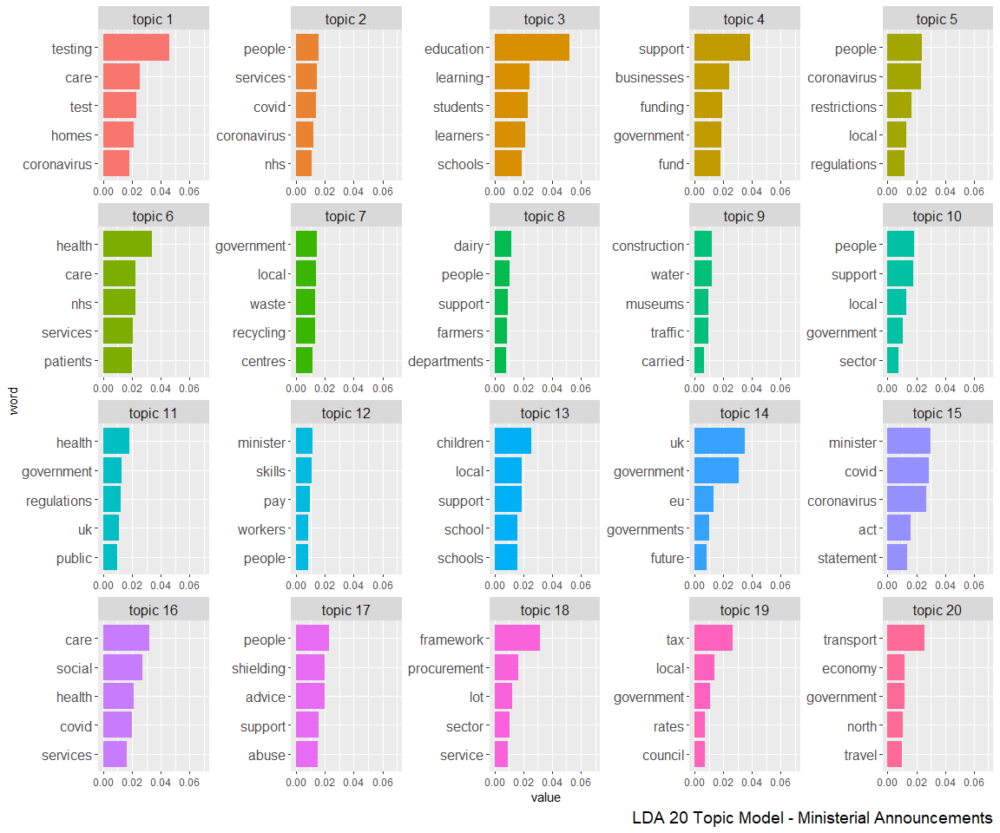
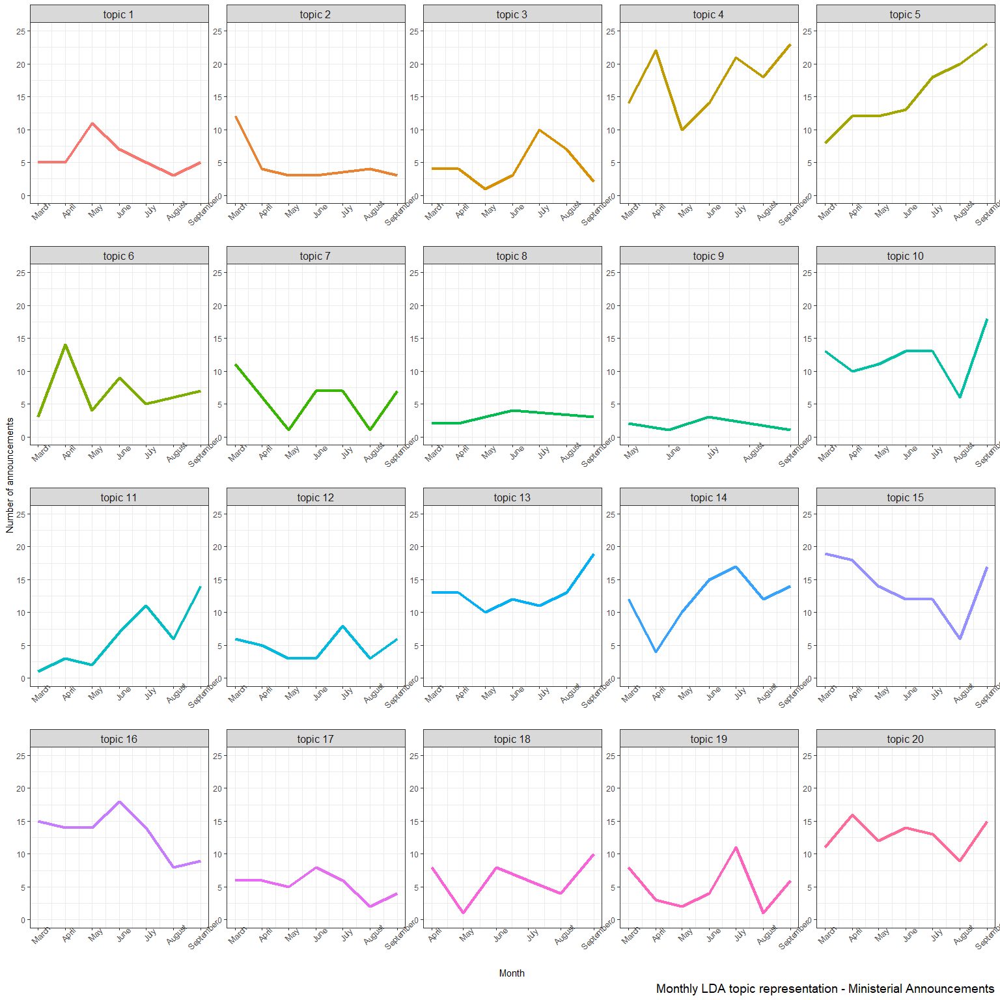

Welsh Government Publications Topics - Ministerial Announcements
================
Jamie Ralph
06/10/2020

In this document I will be building topic models using Welsh ministerial
announcements scraped from the Welsh Government website. The purpose of
this analysis is to provide some insight into how the Welsh Government
has been communicating with the public since the beginning of the
COVID-19 pandemic.

## Pre-process the data

The first step will be to load the data and pre-process it for topic
modeling. This step includes removing text artefacts from the
announcement text (for example: file names, links to social media) and
removing “stop words”.

``` r
web_data <- read_csv(here("sample-datasets", "data_2020-10-05.csv")) %>%
    rename(id = X1)

cleanup_words <- c("pdf", "xlsx", "email", "gov.wales", "kb", "accessible", "format", "interactive", "tools", "telephone", "website", "wales", "welsh", "twitter", "facebook", 
                   "if you need a more accessible version of this document please email",
                   "file type", "file size",
                   "if you use assistive technology please tell us what this is",
                   "html", "share", "page")
cleanup_words <- str_c(cleanup_words, collapse = "|")
prep_data <- web_data %>%
    filter(category == "Ministerial Announcements") %>%
    mutate(
        text = str_to_lower(text),
        text = gsub('[0-9]+', '', text),
        text = str_replace_all(text, cleanup_words, "")
    ) %>%
    unnest_tokens(token,text) %>%
    anti_join(stop_words, by = c("token" = "word"))

prep_data <- prep_data %>%
    nest(data = c(token)) %>%
    mutate(text = map(data, unlist),
           text = map_chr(text, paste, collapse = " "))
```

### Run Latent Dirichlet Allocation with Python.

The next step is to start building topic models with Python. The method
we will use is Latent Dirichlet Allocation (LDA), which works by trying
to find a set number of hidden topics in a collection of documents. Each
topic is assumed to consist of a collection of terms, which we can use
to interpret the topic’s meaning.

First, we will convert the data to a format called a “bag of words”.

``` python
from sklearn.decomposition import LatentDirichletAllocation as LDA
from sklearn.feature_extraction.text import CountVectorizer
from nltk.tokenize.casual import casual_tokenize
import pandas as pd
import numpy as np
# Get data from R environment
text_data = r.prep_data
# Get bag of words matrix for LDA
counter = CountVectorizer(tokenizer=casual_tokenize)
bow_docs = pd.DataFrame(counter.fit_transform(raw_documents=text_data.text)\
                       .toarray())
column_nums, terms = zip(*sorted(zip(counter.vocabulary_.values(),\
                                    counter.vocabulary_.keys())))
bow_docs.columns = terms
```

Next, we run the LDA model with 20 topics. This number is arbitrary, but
we felt it should give good coverage of the data without trying to
extract too many topics.

``` python
# Set the random seed
np.random.seed(100)
all_text_lda = LDA(n_components = 20, learning_method = 'batch', max_iter = 30)
all_text_lda = all_text_lda.fit(bow_docs)
```

Next, we convert the fitted model into a dataframe with the top 5 words
per topic, along with their beta values.

``` python
normalized_components = all_text_lda.components_ / all_text_lda.components_.sum(axis=1)[:, np.newaxis]
components = pd.DataFrame(normalized_components.T, index = terms, columns=['topic {}'.format(i) for i in range(1, 21)])
# Get transpose of matrix
topic_word = components.T
topic_word['topic_number'] = topic_word.index
topic_word = topic_word.melt(id_vars = ['topic_number'], var_name = 'word')
ldia_top_5_words = topic_word.sort_values(by = ['topic_number', 'value'], ascending=False).groupby('topic_number').head(5)
```

### Visualising topics in R

Now that we have a nice clean dataframe, we can visualise the results
back in R.

``` r
lda_words_per_topic <- as_tibble(reticulate::py$ldia_top_5_words)
topic_levels <- sprintf("topic %s", seq(from = 1, to = 20))
lda_plot <- lda_words_per_topic %>%
    mutate(
        topic_number = factor(topic_number, levels = topic_levels),
        word = reorder_within(word, value, topic_number)
    ) %>%
    ggplot(aes(x = word, y = value, fill = topic_number)) +
    geom_col(show.legend = FALSE) +
    scale_x_reordered() +
    ylim(0, 0.07) +
    coord_flip() +
    theme(
        strip.text = element_text(size = 12),
        axis.text.y = element_text(size = 12),
        plot.caption = element_text(size = 14)
    ) +
    labs(
        caption = "LDA 20 Topic Model - Ministerial Announcements"
        ) +
    facet_wrap(~topic_number, scales="free")

lda_plot
```

<!-- -->

There are definitely some interpretable topics in this collection, for
example:

-   Topic 1 - COVID testing
-   Topic 3 - Education
-   Topic 4 - Support for businesses
-   Topic 19 - Local government and council tax

## Get the most represented topic per announcement and plot over time

To get an idea of topics over time, we will assign each announcement its
most likely topic and plot this over time. The first step is to use
Python to extract the most likely topic.

``` python
topic_doc = pd.DataFrame(all_text_lda.transform(bow_docs), columns = ['topic {}'.format(i) for i in range(1, 21)])
topic_doc['id'] = text_data.id
topic_doc['title'] = text_data.title
topic_doc['release_date'] = text_data.release_date
```

Next, we will bring the data into R, tidy the format, and filter out
topics scoring less than 0.3 (this means the announcement likely doesn’t
relate to a particular topic strongly). We will also extract the date
column for plotting.

``` r
topic_doc <- reticulate::py$topic_doc
topic_doc <- topic_doc %>%
    pivot_longer(`topic 1`:`topic 20`, names_to = "topic") %>%
    filter(value >= 0.3) %>%
    mutate(
        release_date = as.Date(release_date, "%d %B %Y"),
        release_month = lubridate::floor_date(release_date, "month")
        )
```

Finally, we can plot the results over time. Here we have plotted the
monthly number of announcements per topic.

``` r
topic_levels <- sprintf("topic %s", seq(from = 1, to = 20))

topic_doc_plot <- topic_doc %>%
    filter(topic %in% sprintf("topic %s", seq(from = 1, to = 20)),
           release_date > "2020-03-01" & release_date < "2020-10-01"
           ) %>%
    mutate(
        topic = factor(topic, levels = topic_levels)
    ) %>%
    group_by(topic, release_month) %>%
    tally() %>%
    ggplot(aes(x = release_month, y = n, color = topic)) +
    geom_line(size = 1.5) +
    scale_x_date(breaks = "1 month", date_labels = "%B") +
    scale_y_continuous(breaks = seq(0, 30, 2)) +
    theme_bw() +
    theme(legend.position = "none",
          axis.text.x = element_text(angle = 45),
          strip.text = element_text(size = 12),
          plot.caption = element_text(size = 14)
          ) +
    ylim(c(0, 25)) +
    labs(
        x = "Month",
        y = "Number of announcements",
        caption = "Monthly LDA topic representation - Ministerial Announcements"
    ) +
    facet_wrap(~topic, scales = "free")

topic_doc_plot
```

<!-- -->

There are some interesting trends here, for example:

-   Announcements about COVID restrictions have increased substantially
    (topic 5)
-   Announcements about education peaked in the summer and are now
    decreasing (topic 3)
-   Announcements about health and social care decreased over summer
    (topic 16)
